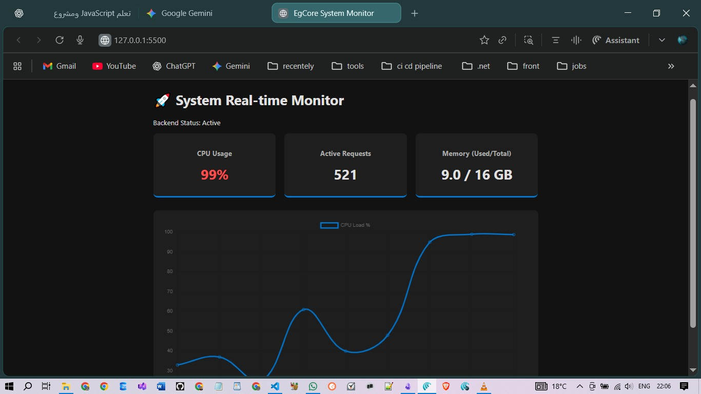

# 🚀 Real-time System Monitor Dashboard

A high-performance, production-ready system monitoring dashboard built with **Vanilla JavaScript (ES6+)**. This project serves as a practical implementation of advanced JavaScript concepts, structured with a **Clean Architecture** mindset similar to .NET backend standards.



---


## 🏗 Modular Architecture

The project is structured to ensure **Separation of Concerns (SoC)**, making it highly scalable and easy to integrate with real backend services like .NET SignalR.

- **`monitor.js` (Data Service):** Encapsulates the logic for fetching data. It utilizes the **Fetch API** and returns **Promises** to handle asynchronous operations.
- **`ui.js` (View Engine):** Manages all **DOM Manipulation**. It uses modern techniques like **Object Destructuring** and **Template Literals** for efficient rendering.
- **`app.js` (Orchestrator):** The entry point of the application. It manages the **Async Loop** and coordinates between the Service and the View.

---
## 📂 Project Structure

```text
/system-monitor
│── index.html          # Markup structure (The View)
│── style.css           # Styling and layout (Look & Feel)
└── /js
    ├── app.js          # Entry point (Equivalent to Program.cs)
    ├── monitor.js      # Business logic and API data fetching (Service Layer)
    └── ui.js           # DOM manipulation and UI rendering (View Logic)


## 🧠 Core JavaScript Concepts Implemented

### 1. Asynchronous Event Loop & Promises
Instead of blocking the main thread, the dashboard leverages the **Event Loop**. It uses `async/await` to handle **Promises**, ensuring the UI remains fluid (60fps) even while waiting for "network" responses.


### 2. Advanced DOM Manipulation
- **Dynamic Styling:** Updates element styles based on system thresholds (e.g., CPU load alerts).
- **Efficient Updates:** Targeting specific DOM nodes using `querySelector` to minimize browser reflows.

### 3. ES6+ Modern Syntax
- **Nested Destructuring:** Extracting deep JSON data in a single line.
- **Arrow Functions:** Maintaining lexical `this` context and writing cleaner code.
- **ES Modules:** Native `import/export` for a decoupled codebase.

---

## 🛠 Tech Stack

* **HTML5/CSS3:** Dark-themed UI with responsive grid layout.
* **Vanilla JS:** No frameworks, zero dependencies (Core Logic).
* **Chart.js:** For real-time data visualization.
* **JSONPlaceholder:** Used as a mock REST API to demonstrate real-world fetching.

---

## 🚀 Getting Started

1.  **Clone the Repo:**
    ```bash
    git clone https://github.com/Mostafa-Abo-Elhassan/js-project-System-Real-time-Monitor.git
    ```
2.  **Run via Local Server:**
    Since the project uses **ES Modules**, you must use a local server (like VS Code **Live Server** extension) to avoid CORS issues.
3.  **Explore the Code:**
    Check the `js/` folder to see how the logic is decoupled from the UI.

---

## 📈 Roadmap (Next Steps)
- [ ] **SignalR Integration:** Replacing the mock fetch with a real-time WebSocket connection to a .NET Core Backend.
- [ ] **TypeScript Migration:** Adding strong typing to mirror C# development experience.
- [ ] **Unit Testing:** Implementing tests for the data transformation logic.

---

**Developed by Mostafa Mahmoud** *.NET Backend Engineer | Scalable Systems Specialist*
